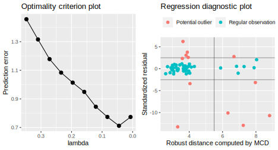
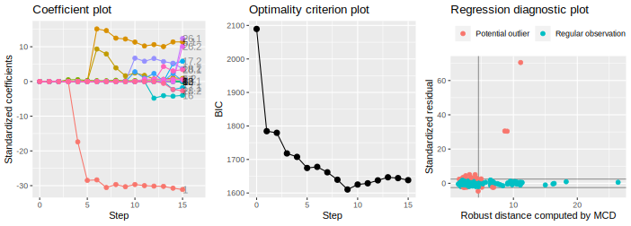

# robustHD: Robust Methods for High-Dimensional Data

## Summary

In regression analysis with high-dimensional data, variable selection is
an important step to (i) overcome computational problems, (ii) improve
prediction performance by variance reduction, and (iii) increase
interpretability of the resulting models due to the smaller number of
variables. However, robust methods are necessary to prevent outlying
data points from distorting the results. The add-on package `robustHD`
for the statistical computing environment `R` provides functionality for
robust linear model selection with high-dimensional data. More
specifically, the implemented functionality includes robust least angle
regression ([Khan et al.,
2007](https://doi.org/10.1198/016214507000000950)), robust groupwise
least angle regression ([Alfons et al.,
2016](https://doi.org/10.1016/j.csda.2015.02.007)), as well as sparse
least trimmed squares regression [Alfons et al.,
2013](https://doi.org/10.1214/12-AOAS575). The latter can be seen as a
trimmed version of the popular lasso regression estimator ([Tibshirani,
1996](https://doi.org/10.1111/j.2517-6161.1996.tb02080.x)). Selecting
the optimal model can be done via cross-validation or an information
criterion, and various plots are available to illustrate model selection
and to evaluate the final model estimates. Furthermore, the package
includes functionality for pre-processing and cleaning the data, such as
robust standardization and winsorization. Finally, `robustHD` follows a
clear object-oriented design and takes advantage of C++ code and
parallel computing to reduce computing time.

## Main functionality

-   `sparseLTS()`: Sparse least trimmed squares regression.

-   `rlars()`: Robust least angle regression.

-   `grplars()` and `rgrplars()`: (Robust) groupwise least angle
    regression.

-   `tslars()` and `rtslars()`: (Robust) least angle regression for time
    series data.

-   `corHuber()`: Robust correlation based on winsorization.

-   `winsorize()`: Data cleaning by winsorization.

-   `robStandardize()`: Data standardization with given functions for
    computing center and scale. By default, the median and MAD are used.

## Installation

Package `robustHD` is on CRAN (The Comprehensive R Archive Network),
hence the latest release can be easily installed from the `R` command
line via

    install.packages("robustHD")

## Building from source

To install the latest (possibly unstable) development version from
GitHub, you can pull this repository and install it from the `R` command
line via

    install.packages("devtools")
    devtools::install_github("aalfons/robustHD")

If you already have package `devtools` installed, you can skip the first
line. Moreover, package `robustHD` contains `C++` code that needs to be
compiled, so you may need to download and install the [necessary tools
for MacOS](https://cran.r-project.org/bin/macosx/tools/) or the
[necessary tools for
Windows](https://cran.r-project.org/bin/windows/Rtools/).

# Example: Sparse least trimmed squares regression

The well-known [NCI-60 cancer cell
panel](https://discover.nci.nih.gov/cellminer/) is used to illustrate
the functionality for sparse least trimmed squares regression. The
protein expressions for a specific protein are selected as the response
variable, and the gene expressions of the 100 genes that have the
highest (robustly estimated) correlations with the response variable are
screened as candidate predictors.

``` text
# load package and data
library("robustHD")
data("nci60")  # contains matrices 'protein' and 'gene'

# define response variable
y <- protein[, 92]
# screen most correlated predictor variables
correlations <- apply(gene, 2, corHuber, y)
keep <- partialOrder(abs(correlations), 100, decreasing = TRUE)
X <- gene[, keep]
```

Sparse least trimmed squares is a regularized estimator of the linear
regression model, whose results depend on a non-negative regularization
parameter \[see [Alfons et al.,
2013](https://doi.org/10.1214/12-AOAS575)\]. In general, a larger value
of this regularization parameter yields more regression coefficients
being set to zero, which can be seen as a form of variable selection for
the linear model.

For convenience, `sparseLTS()` can internally estimate the smallest
value of the regularization parameter that sets all coefficients to
zero. With `mode = "fraction"`, the values supplied via the argument
`lambda` are then taken as fractions of this estimated value (i.e., they
are multiplied with the internally estimated value). In this example,
the prediction error is estimated via 5-fold cross-validation for
selecting the optimal value of the regularization parameter, and the
seed of the random number generator is supplied for reproducibility.

``` text
# fit sparse least trimmed squares regression and print results
lambda <- seq(0.01, 0.5, length.out = 10)
fit <- sparseLTS(X, y, lambda = lambda, mode = "fraction", crit = "PE",
                 splits = foldControl(K = 5, R = 1), seed = 20210507)
fit
```

    ## 
    ## 5-fold CV results:
    ##         lambda reweighted       raw
    ## 1  0.347703682  1.4572964 1.6215821
    ## 2  0.309842614  1.3157592 1.5232998
    ## 3  0.271981547  1.1783524 1.4194223
    ## 4  0.234120479  1.0837333 1.3122837
    ## 5  0.196259412  1.0137302 1.2284962
    ## 6  0.158398344  0.9490259 1.1709616
    ## 7  0.120537276  0.8450414 1.0669884
    ## 8  0.082676209  0.7736669 0.9138857
    ## 9  0.044815141  0.7119135 0.7244448
    ## 10 0.006954074  0.7733818 0.7733818
    ## 
    ## Optimal lambda:
    ## reweighted        raw 
    ## 0.04481514 0.04481514 
    ## 
    ## Final model:
    ## 
    ## Call:
    ## sparseLTS(x = X, y = y, lambda = 0.0448151412422958)
    ## 
    ## Coefficients:
    ##  (Intercept)         8502        21786          134         4454         1106 
    ## -3.709498642  0.593549132  0.033366829  0.115955965  0.015899659  0.020447909 
    ##        20125         8510        14785        17400         8460         8120 
    ## -0.091451556  0.111369625 -0.014556471  0.002262256 -0.003669024  0.112165149 
    ##        18447        15622         7696         5550        16784        13547 
    ## -0.229292900 -0.008785651  0.020915212  0.005880150  0.015398316  0.037262275 
    ##                                    
    ## Penalty parameter:       0.04481514
    ## Residual scale estimate: 0.62751742

Among other information, the output prints the results of the final
model fit, which here consists of 17 genes (with non-zero coefficients).

When selecting the optimal model fit by estimating the prediction error,
the final model estimate on the full data is computed only with the
optimal value of the regularization parameter instead of the full grid.
For visual inspection of the results, function `critPlot()` produces a
plot of the values of the optimality criterion (in this example, the
root trimmed mean squared error) against the values of the
regularization parameter. Moreover, function `diagnosticPlot()` allows
to produce various diagnostic plots for the optimal model fit.

<figure>
<figcaption aria-hidden="true">Examples of the optimality criterion plot (<em>left</em>) and the regression diagnostic plot (<em>right</em>) for output of function <code>sparseLTS()</code> in package <code>robustHD</code>.</figcaption>
</figure>

# Example: Robust groupwise least angle regression

Package `robustHD` provides implementations of robust least angle
regression ([Khan et al.,
2007](https://doi.org/10.1198/016214507000000950)) and robust groupwise
least angle regression ([Alfons et al.,
2016](https://doi.org/10.1016/j.csda.2015.02.007)). Both methods follow
a hybrid model selection strategy: first obtain a sequence of important
candidate predictors, then fit submodels along that sequence via robust
regressions. Here, data on cars featured in the popular television show
*Top Gear* are used to illustrate this functionality..

The response variable is the fuel consumption in miles per gallon (MPG),
with all remaining variables used as candidate predictors. Information
on the car model is first removed from the data set, and the car price
is log-transformed. In addition, only observations with complete
information are used in this illustrative example.

``` text
# load package and data
library("robustHD")
data("TopGear")

# keep complete observations and remove information on car model
keep <- complete.cases(TopGear)
TopGear <- TopGear[keep, -(1:3)]
# log-transform price
TopGear$Price <- log(TopGear$Price)
```

As the *Top Gear* data set contains several categorical variables (i.e.,
groups of dummy variables in a linear model), robust groupwise least
angle regression is used here. Function `rgrplars()` allows to set the
maximum number of candidate predictor groups to be sequenced via
argument `sMax`. Note that the formula interface automatically
transforms categorical variables to groups of dummy variables.
Furthermore, the optimal submodel along the sequence is selected via the
Bayesian information criterion (BIC) in this example. The robust
regression estimator used to estimate the submodels uses an initial
subsampling of observations, hence the seed of the random number
generator is supplied for reproducibility.

``` text
# fit robust groupwise least angle regression and print results
fit <- rgrplars(MPG ~ ., data = TopGear, sMax = 15, 
                crit = "BIC", seed = 20210507)
fit
```

    ## 
    ## Call:
    ## rgrplars(formula = MPG ~ ., data = TopGear, sMax = 15, crit = "BIC", 
    ##     seed = 20210507)
    ## 
    ## Sequence of moves:
    ##       1 2 3 4  5 6  7  8 9 10 11 12 13 14 15
    ## Group 6 4 8 1 10 5 12 13 9 18 27 16 28 17 26
    ## 
    ## Coefficients of optimal submodel:
    ##     (Intercept)      FuelPetrol    Displacement DriveWheelFront  DriveWheelRear 
    ##   149.512783142   -12.905795146    -0.003968404     5.374692058     0.612416948 
    ##             BHP    Acceleration        TopSpeed          Weight           Width 
    ##     0.015265327     0.530554736    -0.191667161    -0.001817037    -0.013641306 
    ##          Height 
    ##    -0.029560052 
    ## 
    ## Optimal step: 9

The output prints information on the sequence of predictor groups, as
well as the results of the final model fit. Here, 9 predictor groups
consisting of 10 individual covariates are selected into the final
model.

When the optimal model fit is selected via BIC, each submodel along the
sequence is estimated on the full data set. In this case, a plot of the
coefficient path along the sequence can be produced via the function
`coefPlot()`. Functions `critPlot()` and `diagnosticPlot()` are again
available to produce similar plots as in the previous example.

<figure>
<figcaption aria-hidden="true">Examples of the coefficient plot (<em>left</em>), the optimality criterion plot (<em>center</em>), and the regression diagnostic plot (<em>right</em>) for output of function <code>rgrplars()</code> in package <code>robustHD</code>.</figcaption>
</figure>

## Community guidelines

### Report issues and request features

If you experience any bugs or issues or if you have any suggestions for
additional features, please submit an issue via the *Issues* tab of this
repository. Please have a look at existing issues first to see if your
problem for feature request has already been discussed.

### Contribute to the package

In order to contribute to the package, you can fork this repository and
create a pull request after implementing the desired functionality.

### Ask for help

If you need help using the package, or if you are interested in
collaborations related to this project, please get in touch: alfons at
ese dot eur dot nl

## References

Alfons, A., Croux, C. and Gelper, S. (2013) Sparse least trimmed squares
regression for analyzing high-dimensional large data sets. The Annals of
Applied Statistics, 7(1), 226–248. DOI
[10.1214/12-AOAS575](https://doi.org/10.1214/12-AOAS575).

Alfons, A., Croux, C. and Gelper, S. (2016) Robust groupwise least angle
regression. Computational Statistics & Data Analysis, 93, 421–435. DOI
[10.1016/j.csda.2015.02.007](https://doi.org/10.1016/j.csda.2015.02.007).

Khan, J.A., Van Aelst, S. and Zamar, R.H. (2007) Robust linear model
selection based on least angle regression. Journal of the American
Statistical Association, 102(480), 1289–1299. DOI
[10.1198/016214507000000950](https://doi.org/10.1198/016214507000000950).

Tibshirani, R. (1996) Regression shrinkage and selection via the lasso.
Journal of the Royal Statistical Society, Series B, 58(1), 267–288. DOI
[10.1111/j.2517-6161.1996.tb02080.x](https://doi.org/10.1111/j.2517-6161.1996.tb02080.x).
